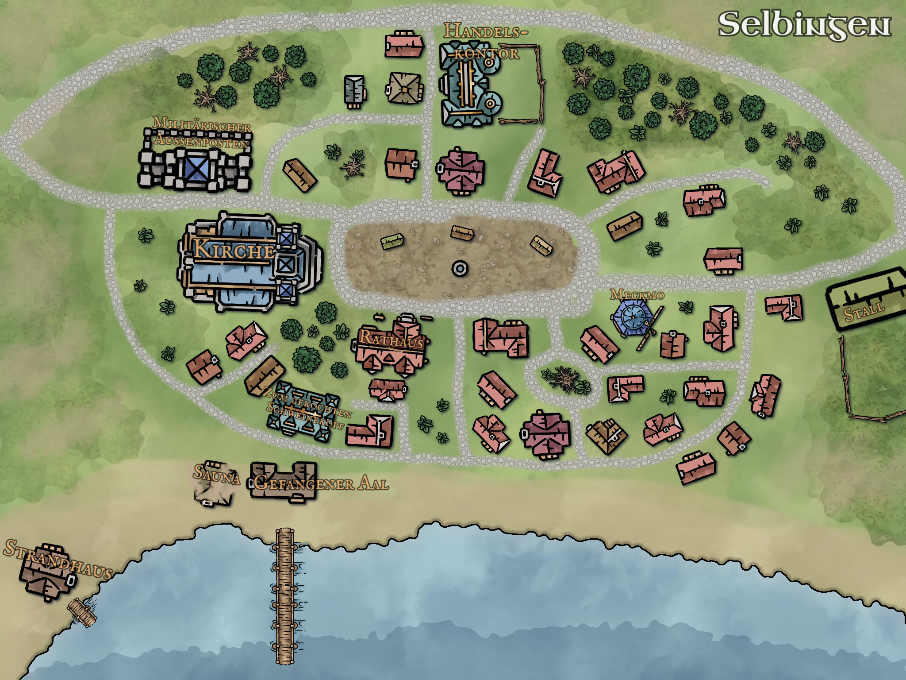
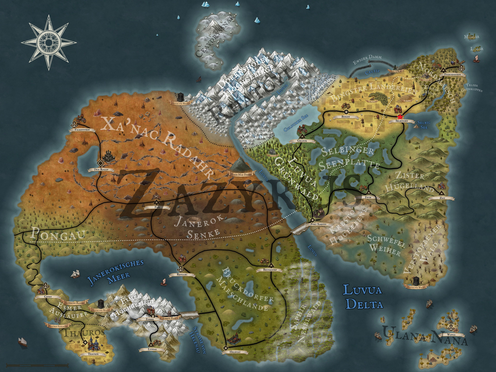

Mit vereinten Kräften konnten unsere vier Helden im letzten Blog ihr Heim gerade so gegen die Blassen verteidigen. Allerdings erfuhren sie auch, dass noch mehr Eindringlinge Selbingen heimgesucht hatten, als ihnen begegnet sind. Diese haben offensichtlich einen großen Brand auf der anderen Seite von Selbingen entfacht – zumindest explodierte dort zum Ende des letzten Blogs etwas in einem großen Feuerball.

Das reicht unseren vier Freunden als Grund, ihre gut zu verteidigende Position aufzugeben. Sie schnappen sich ihre Waffen, verriegeln ihr Haus so gut es geht und machen sich auf den Weg zum großen Feuer. Dieser gestaltet sich dabei deutlich anspruchsvoller als erwartet, da sie nebenbei auch noch den ein oder anderen Gegner eliminieren müssen. Dabei steigt ihr Blassen-Counter auf satte acht Gegner, die die Stadt nie wieder verwüsten werden. Im Laufschritt nähern sie sich dem Brand. Heiße Luft schlägt ihnen ins Gesicht, und vor lauter Qualm fällt ihnen das Atmen immer schwerer. Doch dann sehen sie endlich, was hier vor ihren Augen lichterloh brennt. Der Stall von Bibiane ist inzwischen nur noch vage zu erkennen, aber so gut kennen sie sich in Selbingen aus, um zu wissen, dass hier einst ein Stall stand.

Wie so oft nimmt Aldric das Zepter des Handelns in die Hand und weist Kel Tuh Las an, schnell die Kirche aufzusuchen und möglichst viele Helfer zu organisieren, um das Feuer zu löschen. Löwenzahn, Theo und er selbst sichern zunächst das Gelände und beginnen dann schon einmal mit den Löscharbeiten. Sofort setzen sich alle in Bewegung. Zu ihrer Sorge finden sie keine Spur von Bibiane, und bei den meterhohen Flammen trauen sie sich auch nicht, in der brennenden Ruine nach ihr zu suchen. Da bisher aber noch kein Löschpersonal eingetroffen ist, schlägt Aldric vor, das Feuer zu nutzen, um die Leichen der Eindringlinge zu verbrennen. Das finden Kel und Theo ziemlich schlau, und so sammeln sie jede Leiche ein, die sie finden können. Diesen nehmen sie sowohl Rüstung als auch Waffen ab und werfen die Körper in die Flammen.

Doch dann kommen endlich einige der Bewohner Selbingens mit haufenweise Eimern an, und mit vereinten Kräften schaffen sie es, den Stall zu löschen. Völlig erschöpft und mit einigen Blessuren stehen unsere vier Freunde und halb Selbingen nun vor dem tropfenden Stall und entschließen, dass es für die Nacht genug ist. So verziehen sich alle Stück für Stück in ihre Häuser, und auch unsere Freunde gehen, völlig bepackt mit diversen Rüstungen und Waffen, zurück zu ihrem ausgeborgten Haus, das die Nacht wirklich erstaunlich gut überstanden hat. Sie treten durch die Tür und werfen kraftlos die Ausrüstung der Blassen in eine Ecke ihres Heims, bevor sie erschöpft in ihre Betten fallen und in einen tiefen Schlaf sinken.

  

So wirklich lang hält dieser aber nicht, da schon bald helle Sonnenstrahlen durch die Fenster ihrer Unterkunft strahlen. Nach einigen Schlucken aus ihren Wasserschläuchen und ein paar Bissen von ihrem Proviant geht es für die vier wieder nach draußen. Sie machen sich auf zu einem Rundgang durch den Ort, um einen Überblick über die Schäden zu erlangen. Nach wenigen Minuten fällt ihnen dabei eine Leiche auf, die sie in der Nacht wohl übersehen haben müssen. Erstaunlicherweise sieht diese nun völlig normal und überhaupt nicht mehr blass und fahl aus. Kel schmeißt sich den Körper über die Schulter und schleppt ihn kurzerhand zurück zu ihrem Haus, damit sie später noch genauere Untersuchungen durchführen können. Doch das soll nicht die einzige Leiche sein, die unsere Helden noch finden müssen. Obwohl der Großteil von Selbingen erstaunlich aufgeräumt aussieht, gibt es doch noch einen anderen Ort neben Bibianes Stall, der ganz schön was abbekommen hat: den Militäraußenposten der königlichen Armee.

Sie öffnen vorsichtig die Tür des Gebäudes und sehen sofort die nächsten drei Opfer des nächtlichen Überfalls. Drei Soldaten sitzen in Freizeitoutfits an einem Tisch, auf dem noch ein Kartenspiel verteilt liegt. In jeder Brust steckt ein präzise geschossener Pfeil, doch weitere Verletzungen oder irgendeine Form von Gegenwehr der Soldaten können sie nicht finden. Auf einer Punkteliste, auf der der aktuelle Punktestand ihres Spiels vermerkt ist, können sie immerhin die Namen der Soldaten ausfindig machen: Matteo, Jeremy und Pascal. Außerdem nimmt Theos feines Näschen einen intensiven Geruch nach Gras wahr, der im ganzen Gebäude hängt. Wirklich viel lernen können sie hier aber nicht mehr, daher verlassen sie die Kaserne und gehen zurück zum Rathaus, um Siegfried Bericht zu erstatten. Dabei entdecken sie ein kleines Holzboot, das am Strand von Selbingen angelandet ist und am Tag zuvor hier noch nicht lag.

Mit eingefallenem Gesicht begrüßt der Bürgermeister die vier in seiner Eingangshalle. Bevor sie etwas sagen können, meint er mit belegter Stimme: „Diesmal hat es Gerd getroffen.“ Sie erfahren, dass Gerd seit Jahrzehnten in Selbingen lebte und früher als Fischer auf dem See gearbeitet hat. Seit einiger Zeit sei er aber zu alt für körperliche Arbeit gewesen, weshalb er überall im Dorf kleinere Arbeiten ausgeführt hat, die Selbingen zugute kommen sollten. Nun sei er bei dem Angriff gestorben. Betroffen sprechen unsere vier ihr Mitleid aus und erzählen von ihren Entdeckungen im Militäraußenposten und an der Leiche, die sie gefunden hatten. Außerdem erwähnen sie auch das kleine Boot, das sie auf dem Weg zum Rathaus entdeckt haben. Siegfried dankt ihnen für die Informationen und ihren Einsatz für die Stadt. Obwohl unsere Freunde schon einen Plan haben, was sie als Nächstes machen, erzählen sie Siegfried noch nichts davon. Was unsere Freunde ausgeheckt haben, erfahrt ihr jedoch erst in zwei Wochen beim nächsten Blog Arkanthia Pen and Paper.

  

