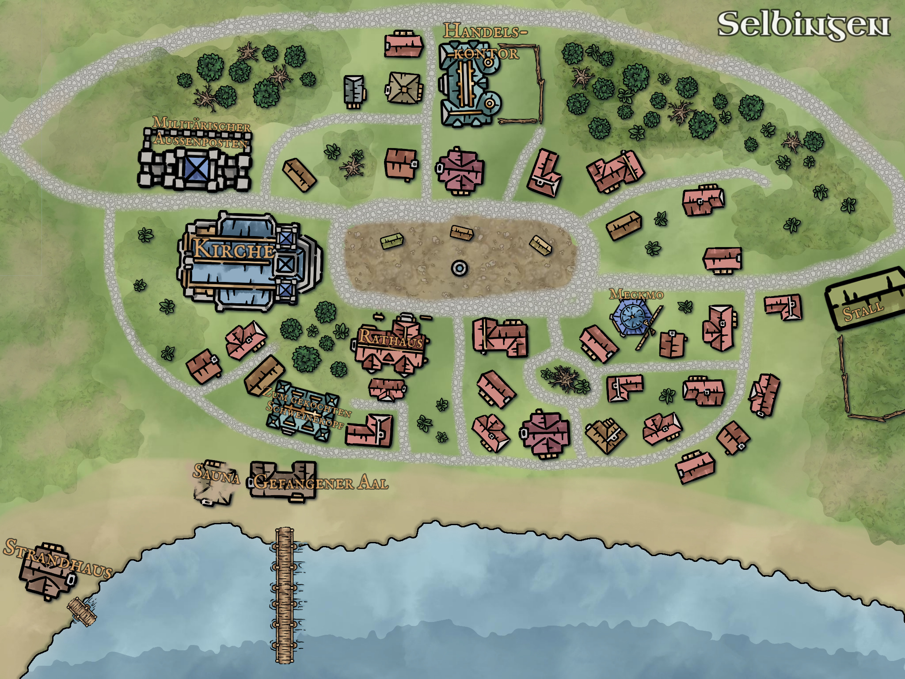
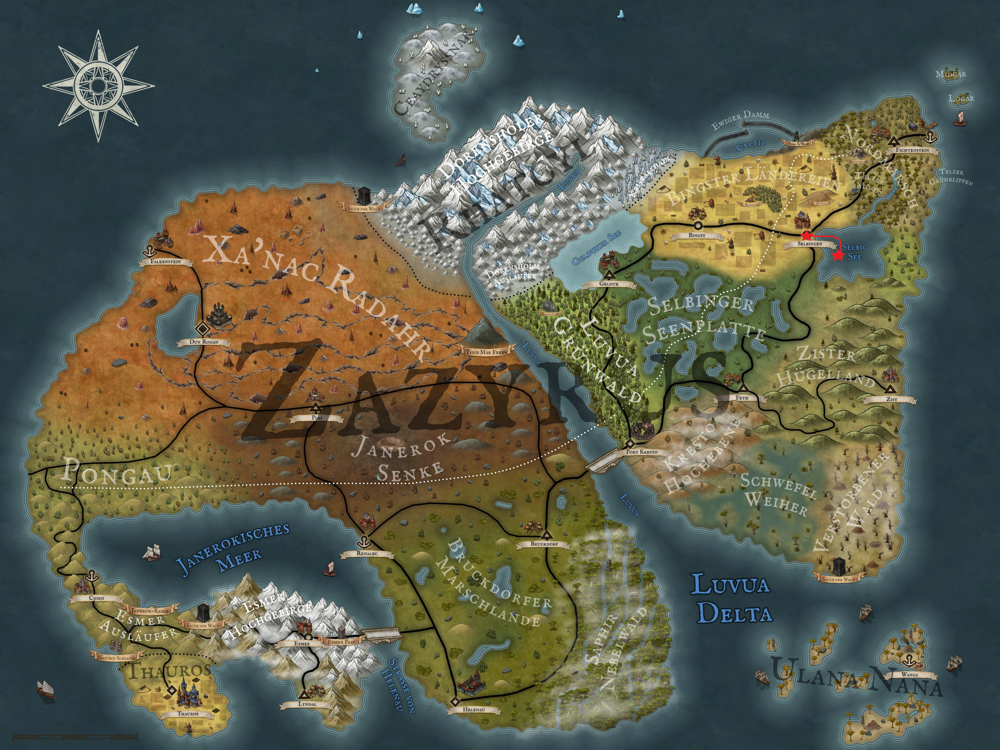

Nach dem erfolgreichen Kampf gegen die Blassen mussten unsere vier Helden feststellen, dass Selbingen noch schwerer getroffen wurde, als sie zunächst vermuteten. Ein Großbrand hatte Bibianes Stall zerstört, und ihre Erkundung am Morgen brachte die traurige Gewissheit über den Verlust des Dorfbewohners Gerd sowie der drei hier stationierten Soldaten. Außerdem entdeckten sie ein verlassenes Boot, das einsam auf den Wellen am steinigen Strand von Selbingen schaukelte. Genau dieses Boot inspirierte unsere vier Freunde zu einem neuen Plan.

Heute wollen sie sich auf den Weg zur Felseninsel in der Mitte des Selbigsees machen, um sie zu erkunden und dort möglicherweise das Versteck der Blassen zu finden. Diese Idee gefällt vor allem Aldric nicht, da er immer noch mit seiner traumatischen Wasserphobie zu kämpfen hat. Doch seine Bedenken werden von der Gruppe großzügig ignoriert. Mit Hilfe eines Seils wird Aldric in das Boot verfrachtet, das sie am Strand gefunden haben, und schon rudern sie los in Richtung Felseninsel.

  

Aus der Ferne wirkt die Insel klein und unscheinbar, doch mit jedem Paddelschlag wächst sie vor ihnen und entpuppt sich schließlich als beeindruckendes Naturdenkmal. Schroffe Felswände ragen steil aus dem ruhigen Wasser empor, und nur ein paar karge Bäume trotzen dem steinigen Untergrund. Sie umrunden die Insel, um eine geeignete Stelle zum Anlegen zu finden, und entdecken eine etwa vierzig Meter breite Öffnung, die ins Innere der Insel führt. Was sie dort sehen, raubt selbst dem vor Angst schweißgebadeten Aldric den Atem: Eine riesige Höhle erstreckt sich tief in die Insel hinein, fast so, als würde eine steinerne Kuppel über ihr thronen. Am Eingang der Höhle finden sie eine flache Stelle, an der sie das Boot sicher anlanden können.

Von hier aus führt ein schmaler Trampelpfad nach oben auf die steinerne Kuppel. Sie folgen dem Weg über rutschige Steinplatten und durch enge Gänge, die von großen Felsen flankiert werden. Nach etwa zehn Minuten erreichen sie eine größere Ebene. Die Aussicht, die sich ihnen hier bietet, können sie allerdings nicht genießen, denn drei fauchende Echsen stürmen plötzlich auf sie zu. Während Löwenzahn stolz verkündet, dass es sich um Gragur-Echsen handelt, ziehen die anderen ihre Waffen und machen sich kampfbereit. Der Kampf erweist sich jedoch als wenig herausfordernd, und sie beseitigen die Gragur-Echsen in Windeseile.

Nun, da die Gefahr gebannt ist, schauen sie sich in Ruhe auf der Ebene um. Auf der gegenüberliegenden Seite entdecken sie einen Felsvorsprung. Neugierig steigen sie hinauf und genießen von dort oben den fantastischen Ausblick über die Insel, den Selbigsee und das umliegende Land. Doch ihre Aufmerksamkeit wird von einem kleinen Loch im Gestein abgelenkt, das in eine enge Höhle führt – so eng, dass sie nicht alle gemeinsam hineinpassen. Theo, der kleinste der Gruppe, bietet sich an, hinein zu klettern und den anderen zu berichten, was er dort entdeckt.

Vorsichtig zwängt sich Theo durch die Felsspalte und gelangt in eine winzige Kammer. Obwohl er keine hohen Erwartungen hatte, ist er dennoch enttäuscht, denn die Höhle ist nahezu leer. Nur eine alte, zusammengefallene Holzkiste steht modrig in einer Ecke. Mangels Alternativen widmet er sich schließlich der Kiste, öffnet sie behutsam und entdeckt eine kleine Phiole mit Öl, eine Strickleiter und ein Fernglas. Was er damit anfangen soll, weiß Theo nicht, und er berichtet seinen Freunden von seinem Fund. Die sind ebenso ratlos, raten ihm aber, die Gegenstände wieder zurückzulegen – sie könnten später noch wichtig sein.

Damit haben sie die Oberfläche der Insel vollständig erkundet und entscheiden sich nun, die Höhle im Inneren der Insel zu untersuchen. Was sie dort erwartet, erfahrt ihr im nächsten Blogbeitrag von Arkanthia Pen and Paper.

  

