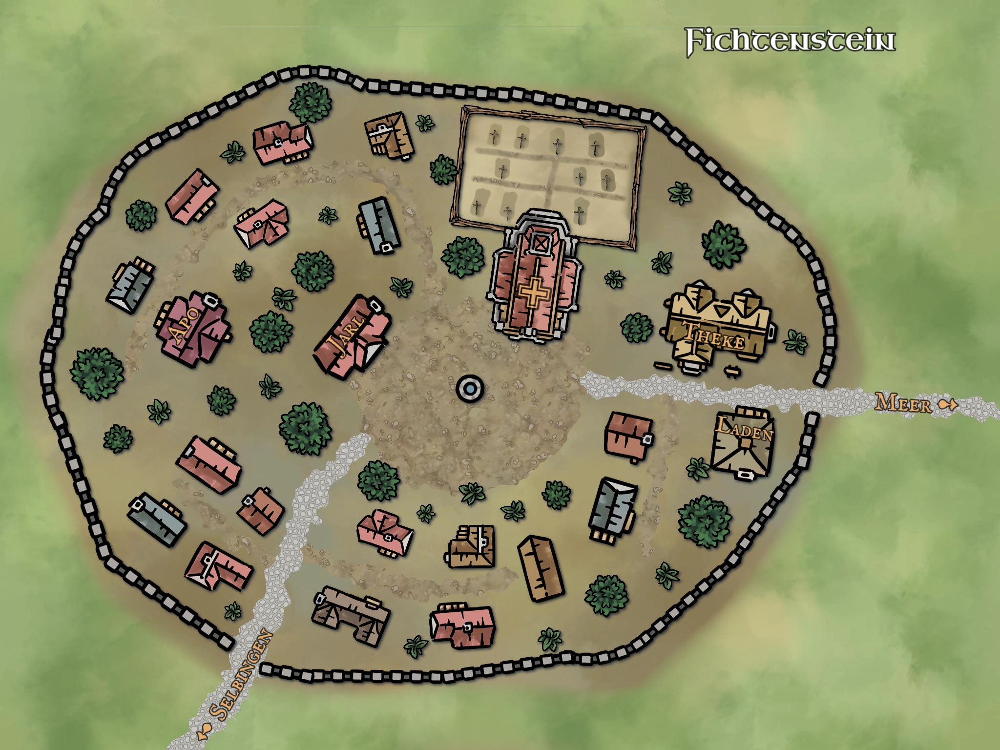

Nachdem unsere vier Helden vor zwei Wochen eine skurrile Hütte entdeckt hatten, aus der tierische Geräusche kamen, entschied sich Aldric dazu, einmal an der Hüttentür zu klopfen. Dies scheint aber unerhört zu bleiben und resultiert in keiner Reaktion. Somit sieht sich nun Löwenzahn gezwungen, etwas zu unternehmen und luschert vorsichtig durch eines der Fenster. Sprachlos starrt er für einige Sekunden in die Hütte, bevor er lauthals anfängt zu lachen und ruft "Da bumsen welche!".

Keine zwei Sekunden später wird er von Kel und Aldric zur Seite gedrängt und auch Theo versucht hüpfend einen Blick in die Hütte zu erhaschen. Tatsächlich erblicken auch sie zwei verkleidete Personen (eine zierliche Katze, sowie einen starken Löwen), bei denen das Sprichwort "übereinander herfallen" mehr als nur wörtlich genommen wird. Doch plötzlich fällt der Blick der Katzen-Lady auf das Fenster, durch das ein Halbork sowie ein Bogenschütze blicken und alle paar Sekunden mal das Augenpaar eines Halblings ins Fenster hüpft. Ein erschrockenen Schrei später, zeigt die Katze ihnen sehr deutlich an, dass sie verschwinden sollen, doch da hat sie die Rechnung ohne unsere Helden gemacht. Selbstredend bleiben sie dort und versuchen die Tür der Hütte aufzukriegen. Beim Blick durch das Fenster hatten sie bereits gesehen, dass diese durch einen Stuhl versperrt ist, doch davon lassen sie sich natürlich nicht abhalten. Während Kel Tuh Las versucht, mit aller Kraft und Schulter voraus in die Tür zu springen und sie so aufzubrechen, hindert ihn ein kritischer Fehlschlag daran und er klatscht kraftlos gegen die morsche Holztür und dann zu Boden. Löwenzahn hat diese Technik genau beobachtet und entscheidet sich daher doch lieber für eine andere. Mit einem wuchtigen Tritt fliegt die Tür aus ihren Angeln und durch die halbe Hütte. Noch bevor sie den Boden berührt, folgen ihr bereits Theo, Löwenzahn und Aldric ins Hütteninnere, während Kel sich noch etwas ächzend auf dem Boden rollt. Die Dame im Kätzchen-Kostüm fühlt sich nun wirklich merklich unwohl, während der Mann im Löwenanzug wie ausgeknockt im Bett liegt. Daher wendet sich Aldric lieber an den ansprechbaren Teil dieses kuriosen Duos und fragt diesen, wen sie denn hier gerade unterbrochen haben. Die Katze stellt sich als Kira, die Tochter der Kräuterfrau Rosvita, vor. Da sie schon ahnt, welche Frage als nächstes kommt, redet sie direkt weiter und erläutert, dass sie schon seit sie klein ist, einen Crush auf Robin, den Jarl von Fichtenstein, habe. Da ihre Mutter eine Künstlerin in der Herstellung von Liebestrank sei, habe sie sich etwas davon gemopst, um mit Robin etwas privatere Zeit genießen zu können. Aber diese sei wohl jetzt Dank ihnen vorbei. Etwas wütend stürmt Kira aus der Hütte und stolper dabei fast über den sich gerade aufrappelnden Kel Tuh Las. Doch weicht sie diesem geschickt aus und verschwindet unter dem Vorwand, für ihre Mutter noch Kräuter sammeln zu müssen.

Nun bleibt ihnen also nichts anderes übrig, als sich mit ihrem halb bewusstlosen Questobjekt zu beschäftigen. Um diesen wieder zurück in die Realität zu holen, behilft sich Theo mit seinem Wasserschlauch, den er in einzelnen Schüben über Robins Gesicht kippt. Bevor die Vier zu richtigem Waterbording übergehen, wacht Robin doch lieber auf und blinzelt sie verwirrt an. Mit schwacher Stimme fragt er, wer sie denn seien und wohin sie ihn gebracht hätten. Diese Frage findet Aldric unerhört und er stellt erst mal fest, dass sie ihn ja mal nirgendwo hingebracht hätten, sondern ihn hier gerade aus einer misslichen Lage befreien würden. Erst jetzt blickt Robin an sich herunter und erkennt, wie misslich seine Lage wirklich ist. Um Kontext bemüht, fragt er daraufhin, was denn passiert sei, was ihm Aldric dann auch in Kurzform zusammen fasst. Bleich wie eine Nebelwand und mit vielen, roten Stressflecken im Gesicht, versucht Robin seine Fassung wieder zu erlangen und fragt die Vier, was denn nötig sei, um seiner Frau eine andere Geschichte zu erzählen. Schließlich wüsse er wirklich nichts von den letzten Tagen und würde so etwas freiwillig auch niemals tun. Ein bisschen Mitleid, aber besonders die Hoffnung auf eine gesteigerte Belohnung, lässt sie sich auf diesen Vorschlag einlassen. Eine zähe Verhandlung später, steht das persönliche Jarlsschwert mit auf der Liste ihrer Questbelohnungen und auch einen Gefallen haben sie bei Robin gut. Sie verständigen sich darauf, den noch schwach wirkenden Jarl gemeinsam zurück nach Fichtenstein zu bringen und ihn dort an seine Frau zu übergeben.

Doch bevor es losgeht, hat Löwenzahn noch ein kleines Angebot für Kel. In Mitten des Chaos, welches in der Hütte herrscht, hat Löwenzahn noch eine Trankphiole gefunden, die noch nicht ganz leer ist. Ein leicht rosa schimmernder Trank bedeckt den Boden der Phiole und wird direkt Kel in die Hand gedrückt. Löwenzahn fragt Kel daraufhin, was er denn davon halten würde, diesen Trank mal zu probieren. Ohne dass weitere Überredungen nötig sind, kippt sich Kel Tuh Las den ganzen restlichen Trank in seinen Rachen und wirft die nun leere Phiole zurück in das Chaos, aus dem Löwenzahn sie auch gefischt hatte. Erstmal passiert nichts, doch plötzlich beginnt Kel einen glasigen Blick zu kriegen und etwas Sabber läuft ihm aus seinem rechten Mundwinkel. Ungeschickt, versucht er einen Flirt mit Löwenzahn zu beginnen und sucht innig nach Körperkontakt. Da ihm dieser nicht nur von Löwenzahn, sondern von allen Anwesenden verwehrt wird, tritt er aus der Hütte hinaus und sieht sich in der Umgebung um. Dabei scheint es ihm eine noch recht kleine Fichte angetan zu haben. Wie in Tranche geht er auf diese zu und beginnt sie zu umarmen und zu liebkosen. Noch bevor er irgendwelche Öffnungen finden kann, wenden sich die anderen lieber von ihm ab und bewegen sich schon mal von der Hütte weg, sodass sie in sicherer Entfernung auf Kel warten können. Während Löwenzahn die Hütte verlässt, entdeckt er noch einen Haarreif mit Katzenohren, welchen Kira beim Verlassen der Hütte an einen Wandhaken gehängt hatte. Mir nichts, dir nichts, schnappt sich Löwenzahn den Reif und setzt ihn ergänzend zu seinem Froschkostüm auf seinen Kopf. Nachdem Kel schließlich fertig mit was auch immer ist, geht es für unsere Vier und Robin zurück nach Fichtenstein. 

  

Mit geschwollener Brust klopfen sie schließlich an die Tür des Jarlshauses. Die Freude von Franziska ist grenzenlos, Robin dagegen fühlt sich noch immer ziemlich unwohl in seiner Haut. Das ist aber ja glücklicherweise nicht das Problem unserer Abenteurer. Sie machen sich viel mehr Gedanken über ihre Belohnung, die ihnen Franziska auch direkt in die Hand drückt und dabei in so ziemlich jeder Form bedankt. Da Franziska ja aber nichts von dem neu verhandelten Quest-Preis weiß, wird nun Robin mit großen Augen angeguckt. Etwas ungeschickt nuschelt er irgendwas in seinen Bart, was am ehesten an "Aber das reicht doch nicht." erinnert und verschwindet in den Tiefen seines Eigenheims. Während ihnen Franziska in der Wartezeit ein Kotelett an Ohr labert, erscheint nach wenigen Minuten endlich eine glänzende Klinge im Flur. Mit sichtbarem Missfallen händigt Robin Kel sein persönliches Jarlsschwert aus und auch Franziska kann die Welt nicht fassen, dass ihr Gatte diese wertvolle Waffe verschenkt. Doch nachdem ihr vorsichtiger Einspruch von Robin in harscher Art aus dem Weg geräumt würde, findet sie sich auch recht schnell mit der Situation ab, ist ja schließlich auch nicht ihr Schwert. Glücklich und zufrieden wenden sich unsere Helden vom Jarlspaar ab und verabschieden sich knapp. Nun heißt es endlich shoppen im Gemischtwarenladen von Hellebard Dunkel, doch das erleben wir erst im nächsten Blog Arkanthia Pen and Paper.

  

