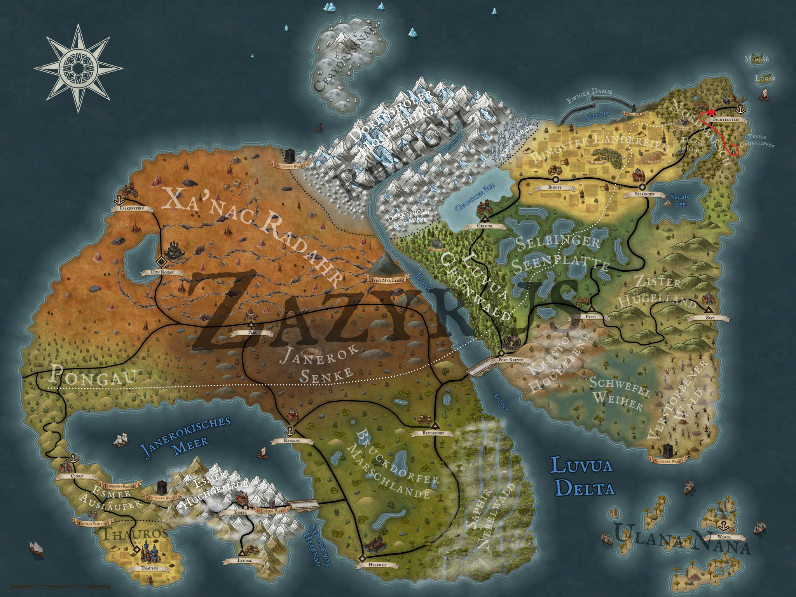

Im letzten Blog konnten unsere Helden Kel Tuh Las, Theo, Aldric und Löwenzahn erfolgreich einige Papageieneier aus den Nestern der Eltern klauen und ebenfalls eine Familie Bachkrabbler auslöschen. Dass das alles nötig war, damit die Kräuterfrau Rosvita einen Liebestrank brauen kann, klingt zwar paradox, ist aber trotzdem so. Nun rasten unsere vier gerade inmitten des Telzer Moors und beratschlagen. 

Eigentlich würden sie jetzt doch ganz gerne die Quest von Leutnant Kampf beginnen. Hierzu müssen sie zum einen den halb verrotteten Kopf von Emanuel bergen, der irgendwo im Moor vor den Toren der Residenz Chiraque liegen sollte. Außerdem brauchen sie ja auch noch einen Ersatz für Emanuel, damit Leutnant Kampf die Geschehnisse in der Residenz Chiraque weiterhin im Auge behalten kann. Hier hat Löwenzahn eine gute Idee und schlägt Kira, die Tochter von Rosvita, vor. Diese soll den Aussagen der Matrosen im Fichtensteiner Hafen zufolge ja kein Kind von Traurigkeit sein und einen besonders guten Draht zu Männern aufbauen können. Und da Herr Chiraque ja bekanntlich einer ist, sollte das eigentlich ganz gut funktionieren. Und falls nicht, hat sie zur Not ja auch noch Zugang zum Liebestrank ihrer Mutter. Leider ist ihnen Kira ja vor kurzem weggelaufen, nachdem unsere Freunde sie in flagranti mit dem Jarl von Fichtenstein erwischt hatten. Aber wenn sie sich eh durch das Moor zurück nach Fichtenstein schlagen, können sie ja auch nach Kira Ausschau halten.

Nun soll es aber erst einmal in Richtung Emanuels Kopf gehen und sie packen ihre Sachen zusammen. Nach etwa zwei Stunden Fußmarsch kommen sie der Residenz Chiraque immer näher und sie beginnen, sich etwas vorsichtiger zu bewegen. Es dauert eine Weile, bis sie die Stelle finden, an der Kel den gefesselten Emanuel enthauptet hat, aber schließlich finden sie die Stelle wieder. Glücklicherweise ist der Kopf noch nicht vollständig von Wölfen, Maden und Fliegen zerfressen, und mit etwas Phantasie kann man noch die Gesichtszüge des ehemaligen Emanuel erkennen. Schnell wird der Kopf in einem Beutel verstaut und das lauschige Örtchen zügig verlassen. 

Jetzt geht es wieder zurück in Richtung Fichtenstein. Doch schon auf dem Weg dorthin entdecken Löwenzahn und Co direkt vor ihnen eine Rauchsäule. Um sich die Situation erstmal in Ruhe anzusehen, soll sich Theo zunächst in diese Richtung vorweg schleichen und in Erfahrung bringen, was sich am Fuße der Rauchsäule verbirgt. Vorsichtig arbeitet er sich auf den Weg durch das sumpfige Dickicht und blickt schließlich auf ein kleines Lager. Die Bewohner sind schwer bewaffnet und wirken nicht sonderlich freundlich. Insgesamt zählt er ein gutes Dutzend Personen. Mit diesen Informationen kehrt er zurück zu seinen Freunden und teilt diese mit ihnen. Obwohl Aldric eigentlich ganz zivilisiert mit den Banditen reden möchte (natürlich interessiert ihn besonders, ob er hier vielleicht eine Armbrust abgreifen kann), sind sich unsere vier doch nicht so sicher, ob das gut gehen wird. So entschließen sie sich dazu, dass Löwenzahn und Aldric das Camp umgehen und Kel gemeinsam mit Theo gerade zu ins Banditenlager marschieren. Falls es doch zu einem Kampf kommen sollte, hätten sie dann wenigstens das Überraschungsmoment. 

Und so schlendern Kel und Theo ganz gemütlich direkt ins Zentrum des Banditenlagers, während sich Aldric und Löwenzahn mit gespanntem Bogen und gezücktem Wurfspeer im Dickicht hinter dem Banditenlager versteckt halten. Das soll sich auch sehr bald bezahlt machen, denn die Mission von Kel und Theo schlägt krachend fehl. Noch bevor die beiden ein Wort sagen können, ziehen die Banditen ihre Waffen und sprinten auf die wohl nicht so willkommenen Besucher zu. Theo und Kel ziehen jetzt natürlich auch ihre Waffen und begeben sich in Angriffsposition.  Für Theo bedeutet das in erster Linie, sich schnell aus dem Staub zu machen, um sich zu verstecken und dann aus dem Hinterhalt anzugreifen. Kel hingegen steht felsenfest im Kreuzfeuer der drei Bogenschützen und erträgt auch die ersten Angriffe der Kurzschwertkämpfer ohne mit der Wimper zu zucken. Doch seine Standhaftigkeit zahlt sich aus, denn plötzlich fliegen den Banditen Aldrics Pfeile und Löwenzahns Speere in den Rücken. Überrumpelt dreht sich ein Teil der Banditen, um auch die weiteren Angreifer bekämpfen zu können. 

Theo ist inzwischen vergessen und versucht seinen Angriffsbonus für versteckte Angriffe mit seinen Wurfdolchen auszunutzen. Allerdings braucht er dafür wohl noch etwas Übung, denn die Dolche fliegen überall hin, nur nicht in die Nähe der Gegner. Er entscheidet sich daher für eine neue Strategie und versucht die Zelte der Banditen in seinen Angriffsplan einzubinden. Er schleicht in ein Zelt und schneidet sich auf der Rückseite wieder heraus, um den dahinter stehenden Banditen den Rest zu geben. Noch während er sich mit dem Dolch in der Hand aufbäumt und diesen im Rücken des Banditen versenkt, schlägt auch Kels Schwert auf den Banditen nieder. Damit ist dieser Bandit aus dem Gefecht und auch seine Kollegen werden regelrecht niedergemäht. Aldric verzeichnet einen Abschuss nach dem anderen und Löwenzahn, der inzwischen in den Nahkampf übergegangen ist, hält ersterem die übrigen Gegner vom Hals.

Nach wenigen Minuten geben die restlichen Banditen auf und fliehen. Jedoch nicht ohne das Aldric ihnen noch den ein oder anderen Pfeil hinterher schickt. Zufrieden mit ihrer Arbeit sehen sich die vier erstmal im Lager um und sind begeistert von all den Gegenständen, die die Banditen zurückgelassen haben. Als erstes beschließen sie, zwei Zelte der Banditen abzubauen und mitzunehmen, um ihre Outdoor-Ausrüstung zu erweitern. Dann packen sie einige haltbare Lebensmittel in ihre Rucksäcke, bevor sie den restlichen Platz mit Kurzschwertern und Bögen füllen. Außerdem bedienen sie sich noch an den Lederrüstungen der Banditen und erhöhen damit gleich ihren Rüstungswert beträchtlich.

Nachdem wirklich jeder Rucksack, jede Tasche und jeder Beutel so voll wie möglich gestopft ist, geht's wieder in Richtung Fichtenstein. Wie geplant halten sie den gesamten Weg über Ausschau nach Kira, doch finden sie weder Kira selbst, noch irgendeine Spur von ihr. Da ihre Rucksäcke aber wirklich schwer sind, ist ihre Begeisterung für zeitaufwendige Umwege eher unterdurchschnittlich und so wählen sie doch lieber den direkten Weg.  So kommen sie ohne Kira am späten Abend in Fichtenstein an und fallen direkt in Udos vorbereitete Betten, diesmal sogar ohne vorher die halbe Bar leer zu saufen. Wie das Abenteuer unserer vier Helden morgen weitergeht, erfahrt ihr aber erst in zwei Wochen bei Arkanthia Pen and Paper.

  

