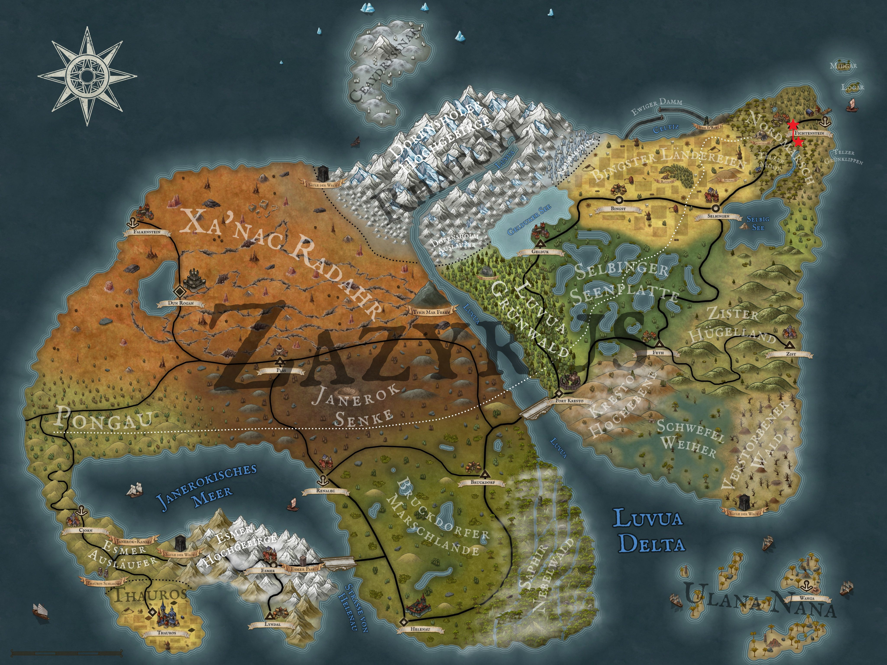

Nachdem Kel Tuh Las, Theo, Aldric und Löwenzahn letztes Mal von Wilhelms Farm aufgebrochen sind, braucht es noch eine gute, dreistündige Wanderung bis schließlich Fichtenstein in Sicht kommt. Ein kleines, von einer Holzpalisade umzogenes Dorf, hebt sich von der ansonsten platten und leicht bewaldeten Landschaft ab. Das Kopfsteinpflaster der Handelsroute führt sie zu einem kleinen Tor, an dem eine schlafende Wache lehnt. Noch bevor sie aber das Tor passieren können, schreckt die Wache aus ihrem Schlaf und guckt sie überrascht an. "Moin, ich bin Simon, euch hab ich hier ja noch nie gesehen" stellt sich die Wache vor. In einem kurzen Smalltalk, in dem unsere vier Abenteurer penibel darauf achten nichts von ihrer Sklavenvergangenheit zu erwähnen, erfahren sie, dass Simon eine von zwei Stadtwachen von Fichtenstein ist. Kevin, die andere Wache, steht zur Zeit am Osttor, das zum Hafen von Fichtenstein gehört. Plötzlich um Gesetze und Arbeitnehmerschutz bedacht, fragt Löwenzahn, wie es denn mit Pausen oder generellen Arbeitszeiten aussehen würde. Diese gibt es aber offensichtlich in der Fichtensteiner Wache nicht, stattdessen handele es sich um einen 24/7 Job, weshalb sie dazu gezwungen sind, auch während der Arbeitszeit zu schlafen. Verwirrt von diesem mehr als sinnlosen Konzept wünschen die Vier Simon noch einen schönen Tag (oder eine gute Nacht, je nachdem was gerade dran ist) und betreten anschließend das erste Dorf ihres Abenteuers.

Fichtenstein ist klein, sehr klein sogar. Neben einem Jarlshaus, einer Kirche, einem Gemischtwarenladen, sowie dem Kräuterladen 'Apo' und dem Gasthaus 'Theke' gibt es nur einige weitere Häuser. Unsere Freunde sind trotzdem mehr als nur euphorisch und legen sofort los, jeden auch noch so irrelevanten Nebencharakter anzusprechen.
Erstes Opfer ist der Inhaber der 'Theke', der Barkeeper Udo. Neben seinem legendären E'Sipp, einem selbst gebrauten Bier, verteilt er außerdem noch die ein oder andere interessante Information. So ist seit kurzer Zeit der Jarl verschwunden und auf dem Friedhof der Kirche scheint ein Grabräuber sein Unwesen zu treiben. Doch unsere Gruppe lässt sich durch solche irrelevanten Quests nicht von ihrem Hauptziel abbringen, möglichst viel Bier in möglichst kurzer Zeit in ihren Kehlen zu versenken. Dabei kommt ihnen eine herausragende Idee. Wie geil wäre es denn, wenn sie das Bier nicht nur in großen Mengen, sondern auch noch umsonst kriegen könnten. Diese Idee präsentieren sie direkt Udo, der erst mal ein großes Fragezeichen im Gesicht stehen hat. Doch dann beginnt Aldric, der sich bereits jetzt als Sprachrohr der Gruppe herauskristallisiert, mit einem umfassenden Plan. Sie würden eine große Feier in Fichtenstein veranstalten und seine Kundenzahl an diesem Abend so deutlich erhöhen. Außerdem würden sie ein Wetttrinken veranstalten, für welches sie das Bier gestellt kriegen, alle anderen Kunden aber bezahlen müssen. Der dadurch viel höhere Profit würde dann locker reichen, um die Kosten ihres Bieres zu tragen. Udo ist erst unsicher und nicht wirklich von der Vertrauenswürdigkeit unser Vier überzeugt. Dagegen ist er sich sicher, dass die vier Schluckspechte sicherlich seinen Biervorrat angreifen werden. Er legt fest, dass mindestens zehn Kunden mehr kommen müssen, als an einem normalen Sonntag. Dann würde er ihnen die Getränkepreise erlassen und zusätzlich noch ein Bett für jeden springen lassen.

  

Kaum dass diese Worte seinen Mund verlassen haben, spurten unsere Vier aus dem Gebäude und beginnen die Werbetrommel zu rühren. Doch da kommt ihnen eine noch bessere Idee und keine fünf Minuten später stehen sie wieder vor Udos Ladentheke. Sie würden gerne ein Fass E'Sipp haben, um mit Freibier ein weiteres Argument für die potentiellen Partygäste zu haben. Dies organisiert Udo fix, lässt es sich aber lieber anzahlen. Mit Bierfass auf der Schulter und großen Plänen versammeln sich die Vier erstmal auf dem kleinen Marktplatz und verkünden lautstark das anstehende Spektakel bei Udo. So richtig funktionieren tut das ganze aber nicht und nur die zwei Zwillinge Thorsten und Torben erscheinen in Nullkommanichts am Zapfhahn. Zu ihrer Frustration müssen sie feststellen, dass die beiden wohl Stammgäste bei Udo sind und nicht zu den zehn neuen Gästen zählen, die sie akquirieren müssen. Gott sei Dank gibt es in Fichtenstein aber nicht allzu viele Stammgäste, sodass sie neben dem Händler Hellebard Dunkel auch einige andere Einwohner des Ortes überzeugen können, den Abend in Udos 'Theke' zu verbringen.

Einer von ihnen ist Ulrich, der direkt neben dem Friedhof wohnt. Hier lebt er zusammen mit seiner Frau Helena und seinen zwei Kindern. Helena macht unseren Freunden nach kurzer Wartezeit auf und begrüßt sie, während von hinten nur Ulrich langsam in den Türrahmen gekrochen kommt. Nach nicht einmal einer halben Minute Gespräch wissen unsere Vier bereits, wer in der Beziehung die Hosen an hat und lernen Helena nur als kratzbürstige Stahlfuchtel kennen. Löwenzahn entgeht allerdings Ulrichs sehnsüchtigen Blick nicht, endlich mal wieder einen Abend in Freiheit verbringen zu dürfen. Und so kommt er etwas später zurück zu jenem Haus geschlichen und ruft leise nach Ulrich. Dieser ist gerade draußen am Wäsche waschen und sichtlich erfreut von Löwenzahns Anblick. Obwohl Löwenzahn so ziemlich alles ist, außer eben sozial geschickt, schafft er es im Handumdrehen, Ulrich von ihrem Fest zu überzeugen.

Mit Ulrich im Schlepptau kommt Löwenzahn also zurück zur 'Theke', zu der auch die anderen Drei bereits fleißig Kunden geschleppt haben. Somit schaffen sie es nicht nur die geforderten zehn Gäste in Fichtenstein zusammen zu sammeln, sondern übersteigen diese Zahl sogar noch um drei. Zufrieden setzen sich Löwenzahn, Aldric und Kel Tuh Las in eine Ecke des Gastraumes, bugsieren das riesige Fass auf den dortigen Tisch und beginnen mit einem 'Ex dein Glas'-Spiel. Die einzige und simple Regel besagt dabei, dass zwei Personen gegeneinander antreten und jeweils einen Krug Bier auf Ex trinken müssen. Der Langsamere verliert und der Schnellere gewinnt. Der jeweilige Einsatz kann vor jeder Runde neu verhandelt werden. Theo ist an dem Spiel zwar interessiert, versucht aber vorher noch dem ein oder anderen Gast mit seinen gezinkten Karten das Geld aus der Tasche zu ziehen, bevor seine Synapsen im Rausche des Alkohols ihn selbst austricksen. So wirklich erfolgreich ist er nicht, aber der ein oder andere Silbertaler springt zumindest heraus. Nach einigen mehr oder weniger erfolgreichen Versuchen gesellt sich aber auch Theo zu seinen bereits leidenschaftlich trinkenden Kollegen. Gerade Löwenzahn scheint sich besonders gut mit Ulrich zu verstehen, der sich offenbar auch schon mehr als eine Lampe ausgeknipst hat. Ob das hier wirklich gut geht oder ob Helena hier den Partycrasher spielt, erfahrt ihr beim nächsten Mal bei Arkanthia Pen and Paper.

  

