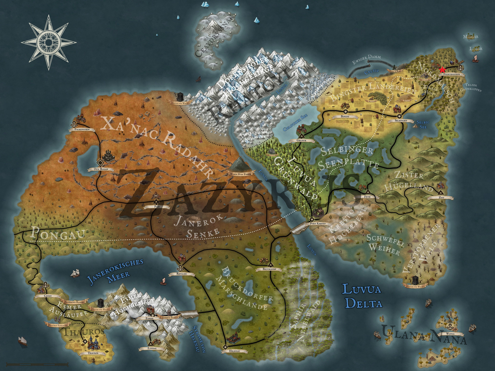

Herzfried Oben, the priest of Fichtenstein, left us with a bit of a cliffhanger in his last blog. Kel had previously asked him what the various freshly sealed graves were all about. Now he answers and has to admit that he doesn't really know himself. There seems to be a grave robber on the loose who has been digging up one or other graves over the last few nights. Herzfried has already started to lock up the shovels at night and has even lain in wait, but tiredness has overcome him every time. However, Herzfried would be very happy if someone else would take a look at the whole thing and keep a night watch. Even without a brightly flashing exclamation mark above Herzfried's head, Kel and Löwenzahn recognize the quest available here and immediately offer to help Herzfried. However, as it is only lunchtime, the two say goodbye for now and return to Udo.

Once there, Kel takes care of his orange trees and digs up the already sad-looking trees. Meanwhile, Löwenzahn realizes that Theo has probably left the taproom in the meantime. Aldric tells him that he has made his way to the herb woman Rosvita and that they want to meet in half an hour at Hellebard Dunkel's general store. Since Löwenzahn is also in the mood for shopping, he sits down with Aldric again and keeps him company in the meantime.

  

While Löwenzahn makes himself comfortable next to Aldric, Theo approaches Rosvita's little hut. Steam billows out of the slightly leaning front door and a wild smell of incense, lavender and weed creeps into Theo's nose. His cautious knock is answered with a dreamy "Come in". Theo slowly steps through the door and sees an elderly lady with tousled, long gray hair sitting in a flat armchair. Dried lavender hangs everywhere in the hut and a selection of different incense sticks glow on a small round wooden table. Rosvita looks at Theo with milky eyes and takes a pleasurable drag on a joint. Theo is so flashed by the whole scene that he pauses for a moment to take in the situation. He realizes that he doesn't even know exactly what he wants from Rosvita. So he simply asks what she could tell him about alchemy. She then explains that all you really need is a copper alchemy pot and you're good to go. Of course, Theo's interest is immediately piqued and he asks if Rosvita has such a pot for sale. She does indeed, but the price makes Theo's ears prick up so much that he is momentarily deaf. So he decides against a copper kettle for the time being and instead asks if he could perhaps buy ready-made potions here. Rosvita shows him her range, which includes a small healing potion as well as a potion of clear air. This has the effect that you no longer smell anything for half an hour and was probably specially designed for Rosvita's pharmacy. Theo could probably use a potion like this too, as the air in the hut is starting to make his head spin. But he can't say for sure whether this is due to the strange smell or the high concentration of THC in the air. Rosvita also has a magical acid that eats through pretty much any material and a love potion on offer. However, she currently lacks the ingredients for the latter. If Theo could get them, Rosvita would show him some of her alchemy skills and offer him a bottle of the love potion on top. Of course, that's all Theo needs to hear and he immediately agrees to the quest. He realizes that he does actually need to hear something else, namely the ingredients that Rosvita needs. But after she has scribbled them down on a small, filthy piece of paper and kindly added notes on where to find each ingredient, Theo finally escapes the haze of the hut.

With a headache but a new side quest in his pocket, Theo heads back towards Hellebard Dark's general store. Here he meets the already waiting Kel Tuh Las, Löwenzahn and Aldric. Together they enter and catch sight of a tall man standing behind a small counter. He introduces himself as Hellebard Dunkel and asks how he can be of assistance. The store's assortment ranges from traveling cutlery and dried food to small weapons and clothing. While Aldric is relieved to see that Hellebard has a bow on offer and that he no longer has to fight his opponents with thrown stones, Theo is also pleased to receive a weapon upgrade from kitchen knife to dagger. Löwenzahn is less interested in weapons, instead he tries to organize even more storage space for his inventory and decides on backpack numbers two and three. Our four also want to equip themselves with sleeping rolls so that they are prepared for future outdoor adventures. After filling their shopping cart, however, they realize that they have no money with which to pay. So the items remain in the shopping cart for the time being and the search for a quest where they can earn a thaler or two is now declared a priority. Their next stop is the Jarl's house, but we won't find out until the next Arkanthia Pen and Paper blog whether they will find their long-awaited financial salvation here.

  

