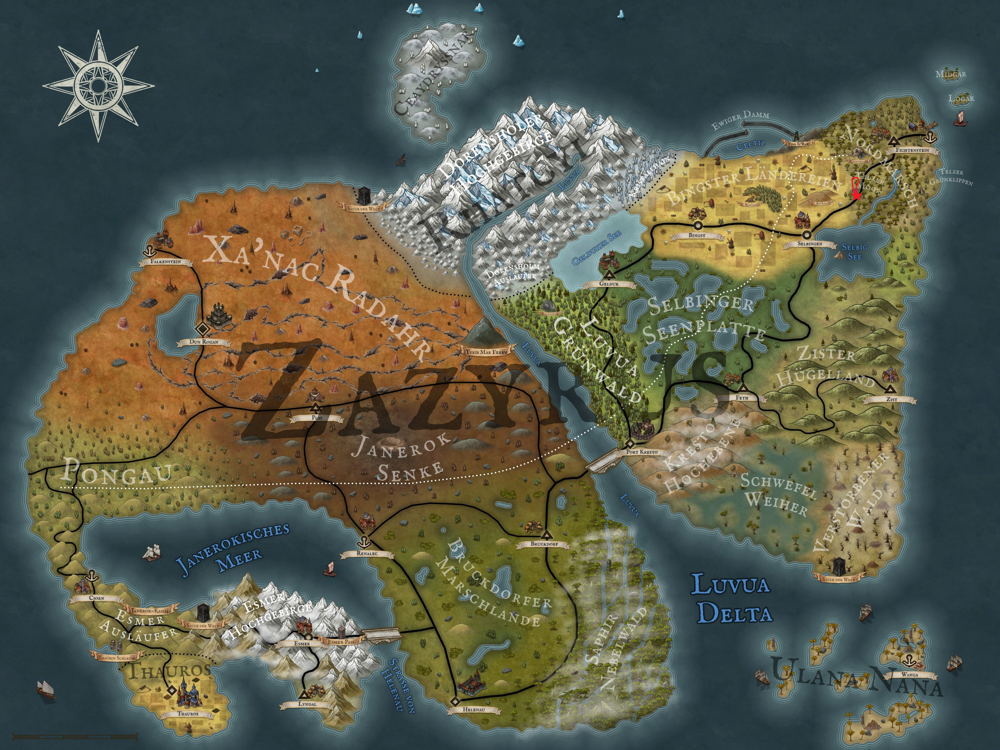

After what felt like an age, our four colleagues Theo, Aldric, Löwenzahn and Kel Tuh Las finally left the small village of Fichtenstein a fortnight ago and set off in the direction of Selbingen. After walking for many hours, they stopped at the inn called 'Der Wanderer' to enjoy a peaceful night's rest on their two-day walk. But their rest was cut short when, just before dinner, the young boy Floren stumbled into the dining room and asked for help. Our heroes were quick to spring into action to save the father, who was being attacked by wolves.

Now they're racing through the twilight forest that stretches for endless kilometres behind the inn. Floren hurries ahead of them, looking back repeatedly as if to check they are still there. They head deeper into the forest, which gets denser and darker the further they go. Then, Floren quickens his pace and reaches a spot in the forest bathed in light. He turns round there and gives them all a cheeky grin. This seems a bit odd to them, so they slow down to take a closer look. The clearing is only just brighter than the rest of the forest and is still obscured by a canopy of leaves. There are a few trees and bushes here and there in the clearing, and there's a carpet of moss covering the ground. But what they don't see are evil wolves or a half-bitten father of Floren. Instead, Aldric suddenly notices an arrowhead sticking out of a bush, and the remaining three also spot strange shadows, footprints or sword sheaths behind the trees. A quick look around confirms that they've been lured into an ambush. At the same time, they draw their weapons and prepare for battle.

Nothing happens for a couple of seconds, but then two arrows fly in Löwenzahn's direction and several swordsmen leap out from behind the trees. They're dressed a bit oddly and look a bit down-and-out, but their swords are gleaming, ready for battle in the last rays of sunlight falling on the clearing. Aldric responds by returning fire with arrow after arrow, targeting the enemy. Meanwhile, Theo carefully drops into the thicket surrounding the clearing and creeps along it to circle the enemies. Löwenzahn and Kel advance, shouting and throwing spears or firing arcane projectiles. But then an elderly man steps out from behind a tree. He's wearing just a tunic and doesn't seem to be armed at first glance. He takes a slow sip from a dark vial he's pulled out of his pocket. He raises both arms in a mystical gesture and silently moves his lips. Suddenly, a shimmering blue arrow appears between his hands and he shoots it into Löwenzahn's chest with a quick movement of his hand. He feels a sharp pain and, gasping, he looks at his chest, but there is nothing there. He is exhausted and frightened and looks at his friends, but they don't know the answer. Then Löwenzahn straightens up again, snorts loudly and storms towards the older man with a furious look in his eyes, while Aldric also focuses his arrows on the sinister mage.

Meanwhile, Theo has made his way across the undergrowth and is now close enough to an archer to plunge his dagger into his loin. His victim falls to the ground immediately and presses a hand to the bleeding area, but that doesn't help either. The second blow from the dagger cuts his throat and his head slumps lifelessly to the forest floor. Theo quickly turns towards the remaining bandits, but they are all quite far away from him. He grabs one of his throwing stars and throws it at a swordsman who is about to attack Kel. But instead of hitting its target, the throwing star spins into the bushes that surround the clearing.

Aldric's fire, together with Löwenzahn's spears, has hit the mage hard. He managed to cast a few more spells, but he's finally taken down by one of Aldric's final arrows. Some of the other bandits are now lying on the ground, unable to fight or have already taken a few hits. Our four adventurers quickly take care of the remaining enemies and are soon alone in the now quiet clearing. But then they spot a small shadow darting out from behind a tree and take off. It's Floren. Rather than letting him get away, the adventurers fire projectiles at the boy and finally bring him down. They quickly run to him and he begs bitterly for his life. But this option isn't discussed for long: Kel splits Floren's head open in familiar fashion with his magical axe. But that's not enough for him, and Kel kicks the remains of Floren's head several more times with his boot until all that's left is pulp. Satisfied, he wipes his boots on the forest floor and turns to leave.

Aldric thinks it would be a good idea to take another look at the strange bottles the mage had been drinking from. It's a small vial made of dark glass. On closer inspection, he notices that Nztrv has been incorporated into the glass, which is why it has that dark shimmer. He opens the vials, but they're already empty. Unfortunately, they don't find any more filled vials in the man's tunic either. They only find a small drop in one bottle. They let it drip into Löwenzahn's open palm, but nothing much happens except that the transparent drop gives off a slight pink glow. They're now really hungry and quickly make their way back to the 'Wanderer', where their food from the last blog is still waiting for them. But our four friends won't find out what awaits them there until the next Arkanthia Pen and Paper blog in a fortnight's time.

  

