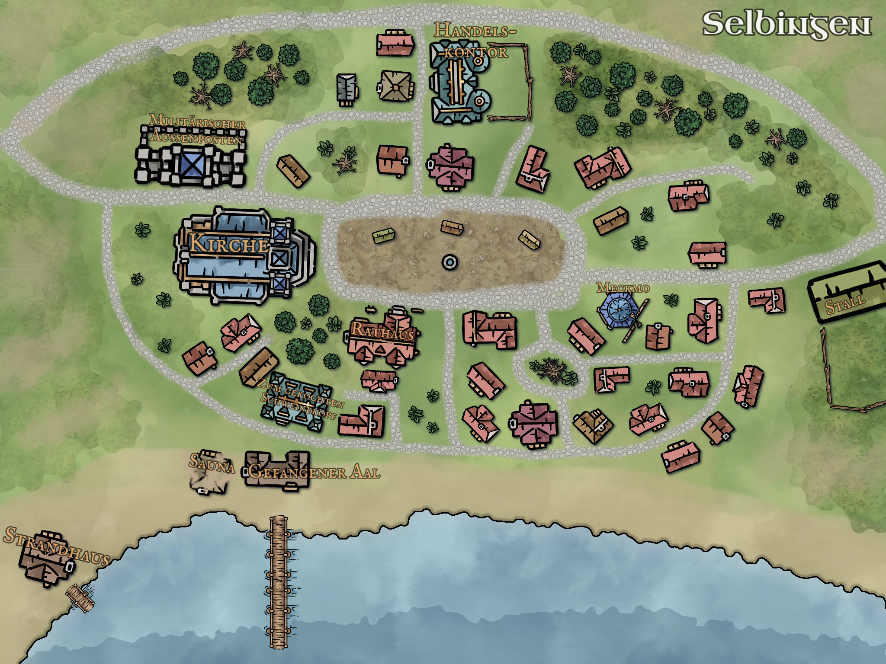
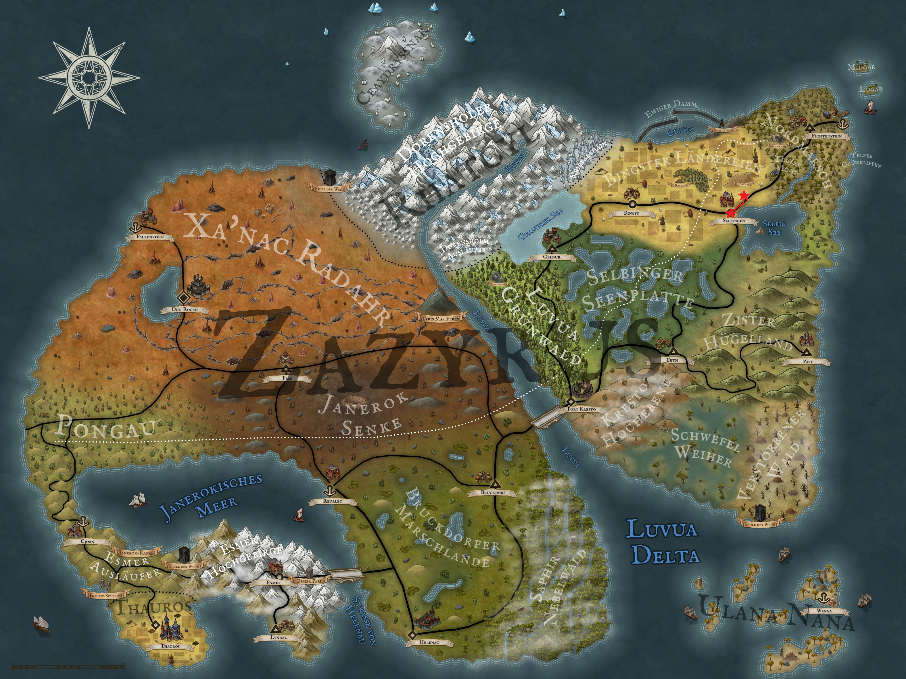

Our four friends arrived in Selbingen for the first time four weeks ago. They have used their time here extensively for shopping and chatting, but today they are leaving the small town again to complete a side quest for the blacksmith Meckmo Hämmerich. He urgently needs new forging materials so that he can offer our heroes goods. Not only for this, but also to forge more weapons. Selbingen needs these to defend itself against the mysterious attacks that plague the village at regular intervals.

  

So all in all, it's quite an important task that the four of them have been entrusted with. They hike north along the Helenau trade route towards Fichtenstein. After just over an hour, however, they leave the main road and turn left across the open field to reach the small low mountain range of Astral. A small track leads them directly to the entrance of the mine. But their first major problem awaits them here: a mother bear has made herself cosy with her two cubs in the entrance area, and all three seem to be daydreaming. Aldric and Löwenzahn, our two nature experts, discuss how they can best eliminate the danger without having to kill the bears. Aldric would certainly be interested in a bearskin, and Kel would also like to hang her mother's head on the wall. But as they don't even own a home yet and would actually feel a twinge of conscience about killing the family in cold blood, they decide to take the animal-friendly route.

They light two torches and run screaming towards the three animals. The mother immediately wakes up, wakes her little ones and stands protectively in front of our friends. But it seems as if she is just trying to gain time, because the two little bears are already running behind her towards the forest. The mother roars angrily at the adventurers one last time before dropping onto her front paws and running after her cubs.

Our friends are a little surprised at how incredibly practical a non-violent solution can be. But before they can think about it for long, they enter the iron mine through the entrance. The walls are narrow and damp, and it gets noticeably colder after just a few steps. They set off in single file and soon find themselves in a labyrinth of intersecting tunnels. Occasionally, small chambers branch off from the main tunnels, where iron ore was probably mined in the past. However, there is hardly any iron ore in these chambers, especially at the beginning. Instead, they experience unpleasant surprises: In one of the smaller chambers, they encounter three cave vipers. Löwenzahn makes short work of them, however. Two are decapitated by his spears and he impales the third from behind, giving him a new ‘snake spear’.

But the mine harbours more than just living dangers. A few metres further on, a pungent smell of sulphur fills their nostrils. It becomes so intense that they quickly start coughing and gasping for breath. They hold their breath and continue through the dark tunnel, where they finally find their first iron ore. Piece by piece, they search the old mine, knock ore out of the walls and carry the heavy chunks back into the daylight. The work underground gets on everyone's nerves, and slowly but surely they become quite fed up with the hard labour. At least Löwenzahn discovers a white flowering plant in the middle of the tunnel, far away from daylight and fertile soil. This has such a motivating effect on him and his companions that they mobilise the last of their strength and hit the stone walls like madmen.

After several hours of hard work, they finally stand outside in front of a full cart. They look at each other with satisfaction and make their way back to Selbingen.

Meckmo can hardly believe his eyes when the heroes arrive at his smithy with the full cart. He enthusiastically begins to roast the ore and process it into metal. But it will be a few days before he can offer them any goods. So they stop watching him at work and make their way to the ‘Boiled Pig's Head’. Luckily, there is not only the eponymous dish, but also all kinds of other delicacies and - what is particularly important to our four friends - plenty of beer. And so they end the evening in peace and quiet, recovering from their hard work in the mine.

Before they go to bed, they want to stretch their legs. Elated, Kel pushes open the door of the inn and suddenly finds himself in a thick fog. With luck, he can see about five metres before everything disappears into the white nothingness. A shiver runs down their spines and they remember what the people of Selbingen had told them: The attacks come on foggy nights! You'll find out if that's true this time too next time you play Arkanthia Pen and Paper.

  

