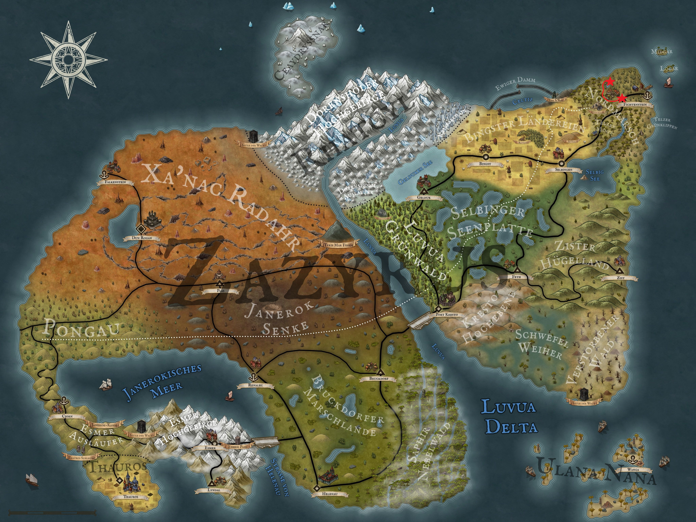

After our four heroes discovered a bizarre hut last time from which animal noises were coming, Aldric decided to knock on the door of the hut. However, this seems to go unheard and results in no response. Löwenzahn now feels compelled to do something and cautiously peeps through one of the windows. Speechless, he stares into the hut for a few seconds before starting to laugh out loud and shouting "There's some banging!".

Less than two seconds later he is pushed aside by Kel and Aldric and Theo also tries to catch a glimpse of the cabin by jumping. In fact, they too catch sight of two people in disguise (a petite cat and a strong lion), with whom the saying "falling over each other" is taken more than literally. But suddenly the cat lady's gaze falls on the window, through which a half-orc and an archer are peering and every few seconds a pair of eyes of a halfling jumps into the window. A startled cry later, the cat clearly tells them to leave, but she has not reckoned with our heroes. Naturally, they stay there and try to get the door of the hut open. Looking through the window, they had already seen that it was blocked by a chair, but of course they don't let that stop them. While Kel Tuh Las tries to jump into the door with all his strength and shoulder first to break it open, a critical failure prevents him from doing so and he claps powerlessly against the rotten wooden door and then to the ground. Löwenzahn has observed this technique closely and decides to use a different one. With a powerful kick, the door flies off its hinges and halfway across the hut. Before it even touches the ground, Theo, Löwenzahn and Aldric are already following it into the hut, while Kel rolls on the floor, still groaning a little. The lady in the kitten costume is now really feeling noticeably unwell, while the man in the lion suit lies in bed as if knocked out. So Aldric turns to the approachable part of this curious duo and asks them who they have just interrupted. The cat introduces herself as Kira, the daughter of the herbalist Rosvita. As she already suspects what question is coming next, she continues straight away and explains that she has had a crush on Robin, the Jarl of Fichtenstein, since she was little. As her mum is an artist in the production of love potions, she has stolen some of it so that she can enjoy some more private time with Robin. But that was probably over now, thanks to them. A little angry, Kira storms out of the hut and almost stumbles over Kel Tuh Las, who is struggling to get up. But she skilfully dodges him and disappears under the pretext of having to collect herbs for her mother.

So now they have no choice but to deal with their half-unconscious quest object. To bring him back to reality, Theo helps himself with his water hose, which he tips over Robin's face in individual spurts. Before the four of them get down to real waterbording, Robin wakes up and blinks at them in confusion. In a weak voice, he asks who they are and where they have taken him. Aldric finds this question outrageous and realises that they haven't taken him anywhere, but have just rescued him from an awkward situation. Only now does Robin look down at himself and realise how awkward his situation really is. Trying to get some context, he then asks what has happened, which Aldric then summarises for him in short form. Pale as a sheet of fog and with many red stress marks on his face, Robin tries to regain his composure and asks the four of them what it would take to tell his wife a different story. After all, he really didn't know anything about the last few days and would never do such a thing voluntarily. A little pity, but especially the hope of an increased reward, makes them agree to this proposal. One tough negotiation later, the personal jarl's sword is on the list of their quest rewards and they also have a favour with Robin. They agree to take the still weak-looking Jarl back to Fichtenstein together and hand him over to his wife there.

But before they set off, Löwenzahn has a little offer for Kel. In the midst of the chaos in the hut, Löwenzahn has found a potion vial that is not quite empty. A slightly pink shimmering potion covers the bottom of the vial and is pressed directly into Kel's hand. Löwenzahn then asks Kel what he would think of trying this potion. Without any further persuasion, Kel Tuh Las pours the rest of the potion down his throat and throws the now empty vial back into the chaos from which Löwenzahn had fished it. Nothing happens at first, but suddenly Kel starts to look glassy-eyed and some drool runs out of the right corner of his mouth. Awkwardly, he tries to start flirting with Löwenzahn and is looking for physical contact. As this is denied to him not only by Löwenzahn, but by all those present, he steps out of the hut and looks around the surroundings. He seems to have taken a fancy to a rather small spruce tree. He approaches it as if by trance and begins to hug and caress it. Before he can find any openings, the others prefer to turn away from him and move away from the hut so that they can wait for Kel at a safe distance. As Löwenzahn leaves the hut, he discovers a hairband with cat ears, which Kira had hung on a wall hook when she left the hut. Without further ado, Löwenzahn grabs the hoop and puts it on his head to complement his frog costume. After Kel is finally done with whatever, our four and Robin head back to Fichtenstein. 

  

With their chests puffed out, they finally knock on the door of the Jarl's house. Franziska's joy is boundless, but Robin still feels rather uncomfortable in his own skin. Fortunately, this is not our adventurers' problem. They are much more concerned about their reward, which Franziska hands them directly and thanks them in pretty much every way possible. But as Franziska doesn't know anything about the renegotiated quest price, Robin is now wide-eyed. Somewhat awkwardly, he mumbles something into his beard that most closely resembles "But that's not enough" and disappears into the depths of his own home. While Franziska babbles a chop in their ears while they wait, a shiny blade finally appears in the hallway after a few minutes. With obvious displeasure, Robin hands Kel his personal jarl's sword and Franziska can't believe that her husband is giving away this valuable weapon. But after her cautious objection is harshly brushed aside by Robin, she quickly comes to terms with the situation - after all, it's not her sword. Happy and satisfied, our heroes turn their backs on the pair of Earls and bid them a brief farewell. Now it's finally time to go shopping in the general shop of Hellebard Dark, but we won't find out until the next Arkanthia Pen and Paper blog.

  

