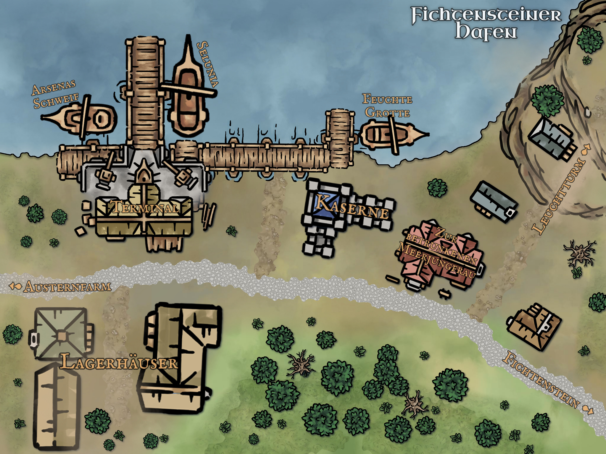
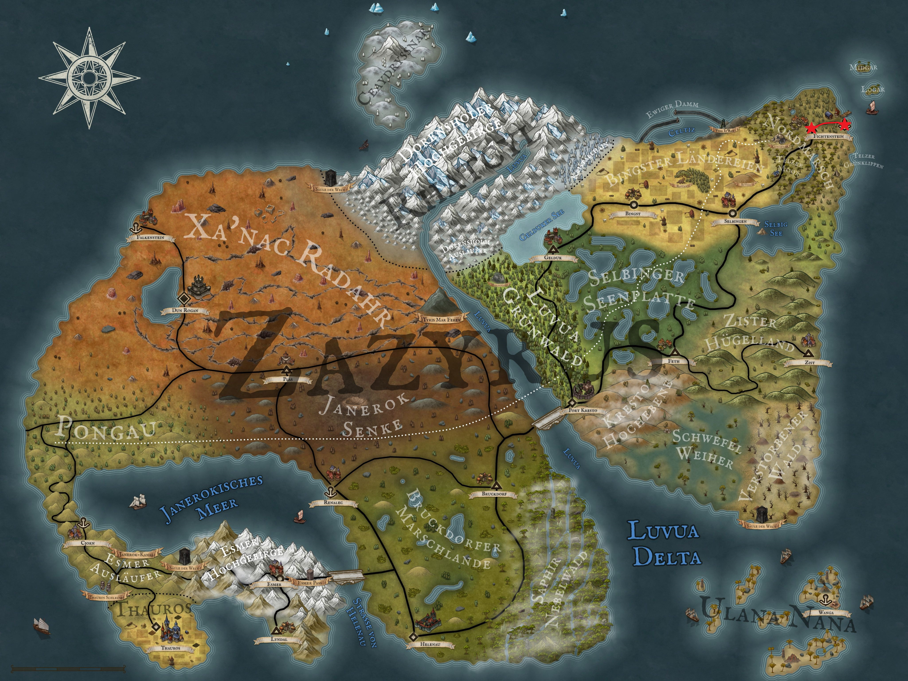

Having not only explored the port of Fichtenstein in the last session, but also broken into it, our four now find themselves standing in front of the loading terminal in the middle of the night, somewhat at a loss. Since they have already broken the law, and it has worked out quite well, they decide to break into the other warehouses and search the cargo stored there. But apart from a few crates of food, decorations and clothes, they find nothing of real interest. Aldric, in particular, was hoping for a crate of weapons so he could finally trade in his stupid hunting bow for a crossbow. At least Theo finds a potion in the last corner. Since he doesn't recognise it, however, it ends up in Theo's pocket unlabelled and rather useless. As the night slowly but surely draws to a close, it's time to go to sleep. Of course, we head back up the mountain to enjoy Udo's free rooms and breakfast, which is usually good.

  

After a short night, the four of us are sitting with sunken eyelids in the bar of Udo's pub, eating fresh bread with spicy salami and each taking a sip of orange juice that Udo has squeezed from the orange trees that Kel brought here and planted a few days ago. Thus fortified, they make their way back down the mountain, but only after a short chat with Simon at the gate. Their path leads them directly to the loading terminal, where a few sailors have gathered at the gate to inspect the broken lock. Undeterred, they walk past the crowd to the first floor and knock politely on the lieutenant's door. With a "come in" that sounds more like a military order than a friendly invitation, they are invited into the office.  The Lieutenant sits at his oversized desk and looks at the four newcomers with the utmost scepticism, asking them in his friendly manner what they want from him. Kel is the first to have the courage to say something, and with great negotiating skills, he starts by telling the Lieutenant that he shouldn't talk to them like that. Actually, the Lieutenant always seems to talk like that, as he is visibly surprised that he has spoken to them inappropriately, and is forced to try to repeat the question in a friendlier tone, which fails miserably and sounds even more unpleasant.

To ease the situation, Aldric takes over and asks why the Lieutenant is interested in the Dornenfell amulet and why he had the bungler Karl Flittenberg dig up half the graveyard for it. The Lieutenant explains that he has received orders from above and will now pass them on to Karl, and that they would like to complain to the King of the Land, Zyr Jea Reng III. The fact that this must be an order from above gives Aldric an idea, and he simply explains that he finds it rather dubious in the office. While Löwenzahn's few brain cells are still busy processing the sentence, Kel Tuh La's intelligence (of which you don't usually get much) finally pays off: he jumps straight to Aldric's statement, explaining that Aldric would also be standing in the shadows. Meanwhile, Theo has also realised what's going on here and joins in, explaining that it was also shady at the cemetery. Lieutenant Kampf is now visibly uncomfortable.
Aldric takes the opportunity to explain in a loud voice that they knew about the shadows.  The lieutenant had already feared this, so he is not really surprised now. He decides not to deny Aldric's statement and instead asks where they got this information from, reverting to his military tone of command. Triumphantly, Aldric pulls the letter from Emanuel of the Chiraque Residence out of his pocket and hands it to Lieutenant Kampf. Less than two seconds later, the four of them see the lieutenant's wrists swelling and his head rapidly changing colour. Cursing, he utters a few curses, insulting Emanuel in all shapes and colours.

After a good minute, he looks at them resolutely and orders them to get Emanuel out of the way, dead or alive. All he needs is proof that Emanuel is incapacitated. Kel's chest swells as he explains that this has already been done and that Emanuel is out of action. The lieutenant is surprised and demands proof. Although they have beaten Emanuel with every trick in the book, they have left his head on and therefore have no real proof of his death. The lieutenant promises them a reward if they bring him proof of Emanuel's death. He also explains that they need a replacement for Emanuel, someone who can keep an eye on the residence and Mr Chiraque and pass on critical information to him. If they complete these two missions, a generous reward awaits the four of them. With the next mission in hand, they are about to leave when Löwenzahn, confused, asks what the Dornenfell family has to do with the Shadows. Mr Kampf explains that the Shadows are descended from the Thornfur family and are now an organisation under Zyren's control. However, as they still value the Thornfur family's foundation, they are trying to regain possession of the few family relics, which is why the graveyard was searched for the one missing amulet. Now Löwenzahn has understood as well and turns to leave.

Satisfied with the conversation, the four discuss the next steps. As well as Emanuel's head, they also need a successor for his position. Löwenzahn has a good idea and suggests Kira, the daughter of the herbalist Rosvita, who has already seduced the Count of Fichtenstein. In addition to this task, you must also find the remaining ingredients for Rosvita's love potion. As all this can be easily combined, they decide to start the next day in this way. But before they end the day at Udo's, they want to dedicate themselves to the last undiscovered structure in Fichtenstein Harbour: the lighthouse. 

A small path leads through rocks and coastal vegetation to an old lighthouse. From here they have a wonderful view not only of the harbour and the small bay, but also of the roaring sea in front of them. They knock on the door cautiously and after a few minutes a small, dishevelled man opens the door and immediately starts chattering excitedly. But even after a three-minute monologue, they still can't make out any real content. Instead, they realise that their nerves can't take much more of this chatter and end the conversation at the first opportunity. 

Half an hour later, the four of them arrive at Udo's and have a drink or two before going to bed. We'll find out in the next Arkanthia Pen and Paper blog whether they'll be as determined as ever the next day, or whether they'll wander off again.

  

