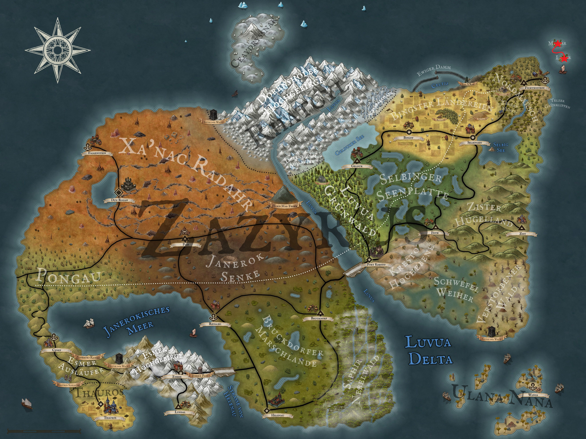

n the last round of Pen and Paper, our four friends investigated José's hidden chest and found an interesting letter there. It suggested that José and an accomplice wanted to capsize a ship on the cliffs of Midgar Island in order to get hold of the ship's valuable cargo. In order to find José, there was no way around travelling to Midgar. They therefore looked for José's friend Eduardo, who was able to offer them a direct journey. However, he failed to mention that they would be using the small longboat of the ‘Selania’, a tiny rowing boat. Nevertheless, they made the crossing to Midgar, where they discovered a grounded ship on the beach that same day. What they didn't find, however, were traces of José. Aldric therefore decided to investigate the boat more closely. He tried to climb the cliffs next to the boat, but slipped on the wet rock faces and fell into the raging waters.

A loud splash followed by a loud cry for help reached Kel, Löwenzahn and Theo, who had just marvelled at Aldric's climbing skills. However, their initial laughter soon sticks in their throats when they realise that Aldric really is in danger. Löwenzahn quickly pulls one of his long ropes out of his backpack, ties it around Kel's torso and sends him into the water to rescue Aldric. Meanwhile, Aldric experiences one nightmare after another. The current sweeps him from A to B without him being able to take any part in choosing the direction. After having several near-death experiences and swallowing litres of salt water, two strong arms suddenly grab him and he is pulled out of the current bit by bit. Coughing up water, Aldric runs away from the beach in panic towards the wooded centre of the island, where he vomits and makes himself comfortable. Apart from the fact that Aldric is now terrified of water, they haven't really achieved anything yet, which is why Löwenzahn also decides to go climbing. However, he has a bit more luck with the dice and actually manages to jump onto the deck of the ship. In addition to broken objects lying around everywhere, he also finds a few corpses. One of them, however, is not wearing the typical sailor's outfit that the rest of the crew are wearing, but rather worn-out leather armour and a shiny golden helmet. This corpse is also snuggling intimately with a strange, light beige stone. Fascinated, Löwenzahn takes a closer look at the stone and it almost seems as if its grain is travelling over the stone in flowing movements. After staring at the stone for a few seconds, Löwenzahn regains consciousness, puts the stone in his rucksack and the helmet on his head before climbing back onto the beach. 

Kel, Theo and Eduardo are waiting for him there with wide eyes. He briefly summarises what he has discovered on the wreck and, when Eduardo asks, describes the body where he found the stone in more detail. Eduardo is immediately convinced that Löwenzahn must have found José and explains that the moonstone now also belongs to him, as he was obviously José's best friend. Our remaining three friends don't agree, however, and before a heated discussion can break out, Eduardo draws his little short sword and attacks them. However, Eduardo is not really a talented swordsman and so he is taken apart pretty quickly even without Aldric's presence. Unfortunately, Kel completely ignores his whimpers for mercy and so the next split head goes to his account.

Now that the mystery surrounding José has been solved, the three of them decide to go and check on Aldric. He is crouching, pale as a sheet, at the edge of the forest next to a large puddle of vomit. Every time he hears the sound of waves, he flinches and covers his ears. Even with their absolutely pathetic social skills, they are unable to calm Aldric down and so they abandon this mission after a while. Instead, they turn their attention to finding food, as the day is slowly drawing to a close. Unfortunately, there is no real wildlife on the small island and since Löwenzahn's fishing skills are also failing today, they meet up with Aldric again after 20 minutes and empty-handed, who is still spinning his wheels. Cleverly, however, they have collected firewood on their way across the island and now make themselves comfortable around a small campfire in the centre of the island. The warmth, but also the distance from the ocean, finally calms Aldric down a little, so that after a while his eyes fall shut and he sinks into a deep sleep.

Loud seagull cries and the smell of salt water wake our four adventurers the next morning. After a quick wash in the sea (Aldric prefers to use his drinking tube for this), the four of them sit down in front of their tents and think about what to do next. Aldric can already see their future life on Midgar, as he is vehemently opposed to travelling any further by boat. However, he is quickly overruled and is confronted with the reality of having to cross the sea again today. As much as he dislikes it, he resigns himself to this fate and slowly and leisurely packs up his things. With a white face, a queasy stomach and a cold sweat on his forehead, he is dragged into the small dinghy of the Selania. He lowers his head and remains in exactly this pose for the rest of the journey, mentally beaming himself into a completely different world. Unfortunately, this means that he doesn't hear his three companions discussing whether they want to visit Logar, the sister island to the south. They unanimously decide in favour and change course to the south. 

They reach the northern end of the island sooner than expected. Aldric is also surprised that they are already moored again after less than two hours. But then he opens his eyes and sees the next beach in front of him. On the verge of a complete nervous breakdown, he begins to clamour at the top of his voice before he loses his strength, stumbles onto the beach and slumps to the ground. Find out what the other three experience on Logar next time on Arkanthia Pen and Paper.

  

