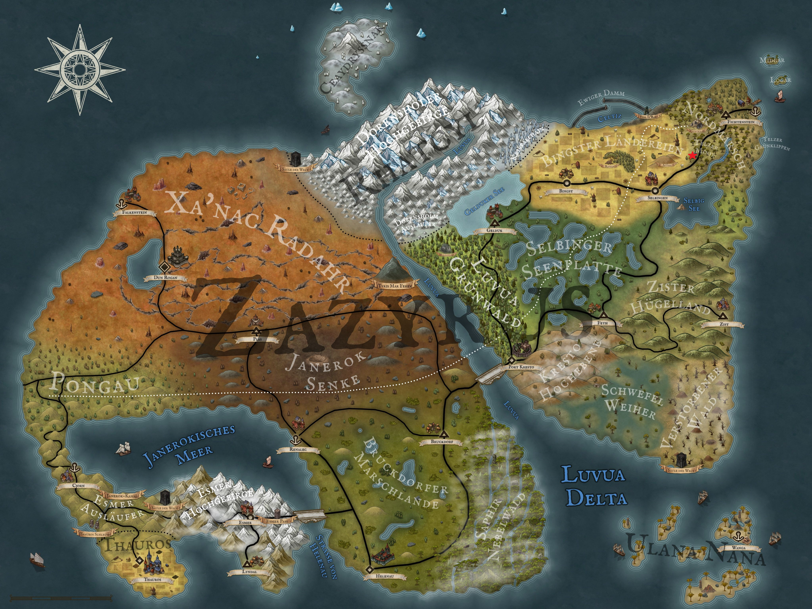

A fierce battle lies behind our four heroes. Exhausted, but full of pride, they drag themselves out of the forest where they were ambushed. On their way back to The Wanderer tavern, they exchange a few tired words about how their good nature was shamelessly exploited by the boy Floren, and how they felt they deserved to punish him. Opinions may differ, but the fact remains: Floren and his gang will never be able to fool anyone again.

After more than twenty minutes, they finally reach the front door of the inn and are warmly welcomed by the landlady, Elisabeth. She has reheated the butcher's platter she prepared two blogs ago so that our heroes can enjoy it while it is still warm. Satisfied, the four of them sit down at the huge table and begin to load plate after plate. Meanwhile, Elisabeth is providing them with plenty of beer, and the atmosphere is getting louder and louder. Soon Elisabeth herself joins her guests, who have now moved to the bar. She notices that Kel Tuh Las is showing more and more interest in her - more than is usually the case. And because she likes Kel's muscular appearance and charming manner, she gradually begins to respond to his compliments.

While Theo, Löwenzahn and Aldric are slowly reaching their limits with alcohol, Kel seems to be waking up in a different way. As the flirting between him and Elisabeth intensifies, the other three decide to withdraw and go to bed. A wise decision, as Kel and Elisabeth deepen their 'conversation' to the point where not only words are exchanged, but also bodily fluids. Before Kel knows it, Elisabeth has thrown him to the wooden floor and the next thing he knows she is on top of him. He lies there breathing heavily, not only from the fall but also from Elisabeth's impressive weight. Shortly afterwards, however, his breathing intensifies for another reason. At this point we decided to leave them alone.

As expected, the next morning starts a little later. To our surprise, Elisabeth was already up and looking very happy. While Aldric, Theo and Löwenzahn can't quite explain why Elisabeth is in such a good mood at first, Kel proudly tells them about the events of the night before - in such vivid detail that the others find it difficult to really enjoy their breakfast. They skilfully steer the conversation to the day's plans, and it is decided to make the march to Selbingen today. Breakfast is therefore shorter than expected and they retire to their rooms to pack.

But Theo has an idea: as a rogue, he might as well start acting like one. So he decides to cheat Elisabeth out of the room bill by sneaking out the window. He quickly packs his things and opens the window. Unfortunately, it has been a damp night and the slippery frame makes his escape difficult. However, Theo overestimates his climbing skills and loses his balance, rolling out of the first floor - right past the kitchen window where Elisabeth is clearing away her breakfast. Outraged, she looks out and immediately storms outside.

Meanwhile, Theo tries to get to the front door unnoticed to tell his friends about his mishap, but instead he hears a loud argument inside, instigated by Elisabeth. A few minutes later, his three companions come out, shake their heads and tell him that Elisabeth had noticed his escape and was quite annoyed. Fortunately, Löwenzahn offered to pay Theo's room bill, which quickly calmed Elisabeth down. They were finally able to leave the inn on good terms.

What awaits our heroes in Selbingen, however, won't be revealed for another two weeks in Arkanthia Pen and Paper.

  

